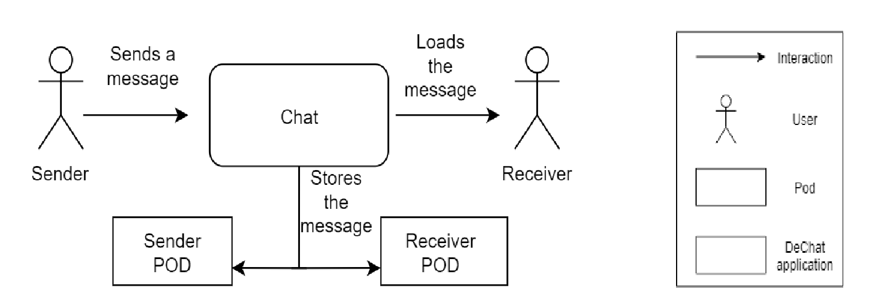

[[section-system-scope-and-context]]
== System Scope and Context

=== What are the goals of the system?

The goal is to create a decentralized chat app based on the solid specifications. The system will be based on a decentralized architecture where data storage is separated from the app. Users can store their chat data in their own pods. The app will allow a user to share pictures, videos or other kinds of files with other friends through the chat. A user can also get notifications when some friend wants to chat with him. Users can have groups of friends with whom they may want to chat and it will be possible to have group chats where all members receive the messages.

.DeChat application diagram
image::./images/SystemDiagram.png[diagram]

=== Business Context

We will have two users (at least) sending and receiving messages, while in the background, RDF will be sharing chat details. The data that the users will exchange will be kept in PODs.

.Business context diagram

* Sender: User of the application that sends a message to other user.
* Receiver: User in the application that receives a message from other user.
* Pod: Each user has a POD where the messages are stored.
* DeChat App: Decentralized chat application through which people is chatting.

=== Technical Context

As the architecture of DeChat is SOLID, we'll be using WebID to communicate between users and friends. In addition, SOLID uses WebSockets, RDF...

Furthermore, we are using a lot of other technologies for building the application as Angular, Javascript... 
The main purpose of building this is allowing the users of SOLID to communiate between them, and for doing that we used the mentioned WebID's, and also some other libraries as RDF.
