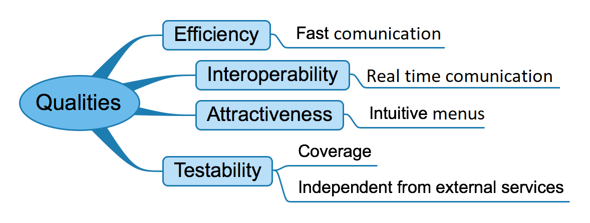

[[section-quality-scenarios]]
== Quality Requirements

=== Quality Tree

.Quality tree diagram

=== Quality Scenarios

[options="header"]
|===
| Reference |Quality attribute |Scenario  | Priority
|  1  | Performance / efficiency | The user will send and receive messages as fast as possible | High, high
|  2  | Scalability            | If the number of users increased, the system must be available and the perfomance mustn't be affected| High, low
|  3  | Interoperability       | The system must exchange, without any lost data, all the messages between the users | Medium, low
|  4  | Managability           | The administrators of the application will manage the application as easy as possible | Medium, low
|  5  | Security               | If a user is not included in a specific chat, the system won't allow him to know anything about the messages of that chat | High, medium
|  6  | Availability           | The system must be available/accessible at any time | High, medium
|  7  | Usability              | The system must be intuitive and easy to use for the user | High, medium
| 9   | Maintainability        | The system will support changes, without affecting the usability of the system | Medium ,low
| 10  | Testabiliy             | The system developers will use their own "special" accounts and POD's where to test any system functionality | Medium, low
|===
